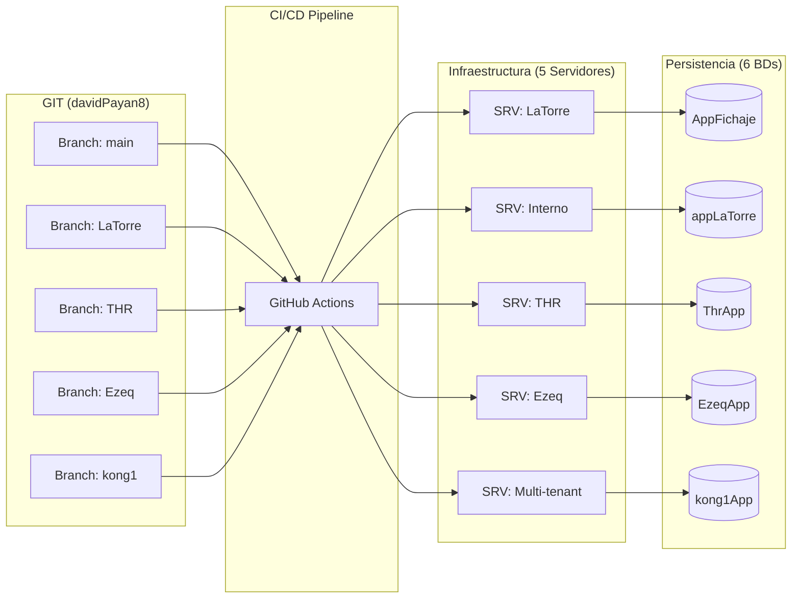

# 🌍 Infraestructura y Despliegue

Este documento detalla la **topología de servidores, bases de datos y estrategia de despliegue** del proyecto Fichaje.

Debido a la evolución histórica del proyecto, la infraestructura actual es compleja y opera en un **estado híbrido** entre modelos Single-tenant (Legacy) y Multi-tenant (Moderno).

## 🗺️ Mapa de Infraestructura

### Resumen de Topología

Actualmente el ecosistema se compone de:

- **6 Bases de Datos SQL Server** independientes.
- **5 Entornos de Producción** (Pares Backend + Frontend).
- **1 Entorno de Pruebas** (Local).

### Bases de Datos (SQL Server)

| Base de Datos | Tipo    | Cliente / Uso        | Estado      | Descripción                                                                                             |
| ------------- | ------- | -------------------- | ----------- | ------------------------------------------------------------------------------------------------------- |
| `appPruebas`  | 🟡 Dev  | Pruebas / Local      | Activo      | Base de datos para desarrollo local. Sin servidor de producción asociado.                               |
| `appLaTorre`  | 🟢 Prod | **Uso Interno**      | Legacy      | Instancia histórica para uso interno de la empresa. _Nombre confuso: no confundir con cliente LaTorre._ |
| `AppFichaje`  | 🟢 Prod | Cliente: **LaTorre** | Legacy      | Instancia dedicada exclusiva para el cliente LaTorre.                                                   |
| `ThrApp`      | 🟢 Prod | Cliente: **THR**     | Legacy      | Instancia dedicada exclusiva para el cliente THR.                                                       |
| `EzeqApp`     | 🟢 Prod | Cliente: **Ezeq**    | Legacy      | Instancia dedicada exclusiva para el cliente Ezeq.                                                      |
| `kong1App`    | 🟢 Prod | **Multi-tenant**     | **Moderno** | Instancia consolidada alojando a **8 clientes** y futuros. Es la arquitectura objetivo.                 |

> [!NOTE] > **Estrategia de Migración**: El objetivo a largo plazo es migrar los clientes de instancias dedicadas (`AppFichaje`, `ThrApp`, `EzeqApp`) hacia entornos consolidados como `kong1App` (o un futuro `kong2App`) para reducir costos y mantenimiento.

---

## 🚀 Estrategia de Despliegue (CI/CD)

El despliegue está automatizado mediante **GitHub Actions** y se basa en una estrategia de **ramas por entorno**.

### Repositorios

El código fuente se gestiona en el usuario `davidPayan8`. Existen repositorios separados para Backend y Frontend, pero comparten la misma lógica de ramas.

### Mapeo de Ramas a Entornos

Cada rama en el repositorio dispara un despliegue a un servidor específico que conecta a una base de datos específica.

| Branch (Git) | Servidor Destino (Back/Front) | Base de Datos Conectada | Apuntes                                                                                |
| ------------ | ----------------------------- | ----------------------- | -------------------------------------------------------------------------------------- |
| `main`       | Servidor LaTorre              | `AppFichaje`            | **¡Cuidado!** `main` no es producción genérica, es específica para el cliente LaTorre. |
| `LaTorre`    | Servidor Interno              | `appLaTorre`            | Para uso interno de la empresa.                                                        |
| `THR`        | Servidor THR                  | `ThrApp`                |                                                                                        |
| `Ezeq`       | Servidor Ezeq                 | `EzeqApp`               |                                                                                        |
| `kong1`      | Servidor Kong                 | `kong1App`              | Rama principal para el desarrollo de la versión Multi-tenant.                          |

### Diagrama de Flujo de Despliegue

---

## ⚙️ Detalles de Configuración

### Vinculación Frontend - Backend

Dado que hay 5 servidores de backend diferentes, cada frontend debe saber a cuál conectar.

- **Build Time**: La URL de la API se "quema" en los archivos de entorno (`environment.prod.ts`) durante la compilación o mediante sustitución de variables en el pipeline de CI/CD.
- **Ramas diferentes**: Es probable que cada rama del frontend tenga configurada la URL de su API correspondiente directamente en el código o configuración.

### Gestión de Servidores

- **Single-tenant (Legacy)**: Se levanta un servidor completo (Node.js proceso + Servidor estático/SSR) por cada cliente grande. Esto escala mal en costes y gestión.
- **Multi-tenant (Kong)**: Un solo servidor atiende a N empresas. La separación de datos se hace por lógica de aplicación (`id_empresa`) en lugar de por infraestructura física.

## ⚠️ Puntos Críticos para Desarrolladores

### 1. Selección de Rama

Cuando desarrolles una nueva feature, **¿dónde debe ir?**

- Si es core: Normalmente a `kong1` y luego cherry-pick/merge a las demás.
- Si es hotfix para un cliente: A su rama específica (`THR`, `Ezeq`, etc.).

### 2. Confusión de Nombres

- `appLaTorre` (BD) -> Es para uso interno.
- `AppFichaje` (BD) -> Es para el cliente LaTorre.
- Rama `main` -> Despliega al cliente LaTorre (no es el trunk genérico habitual).

### 3. Multi-tenancy Híbrido

Al codificar, **SIEMPRE asume que estás en entorno multi-tenant** (filtra por empresa), incluso si el código corre en un servidor dedicado. Esto facilita la migración futura a `kong1App`.
