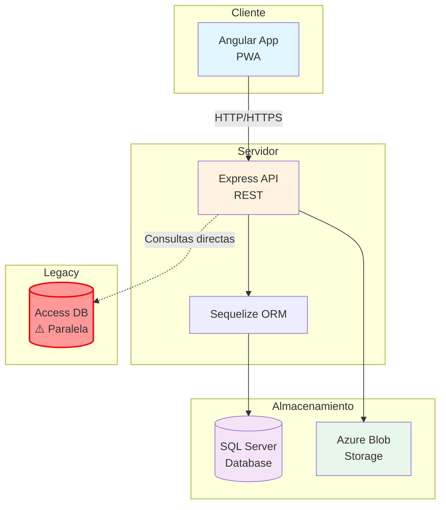
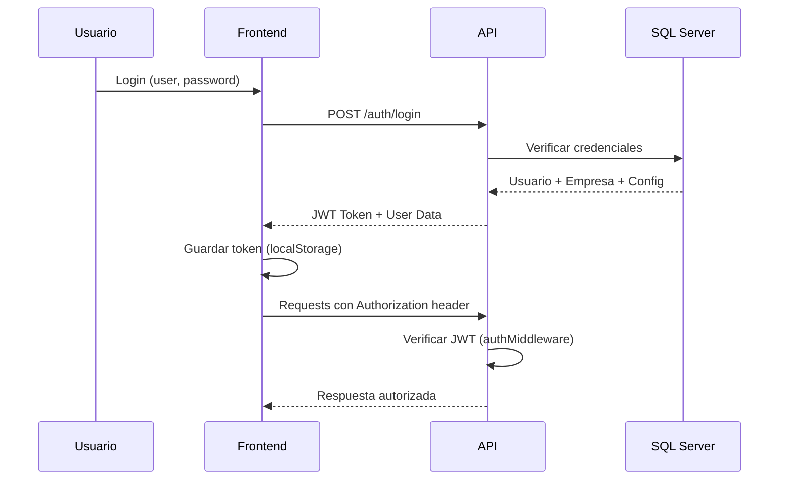
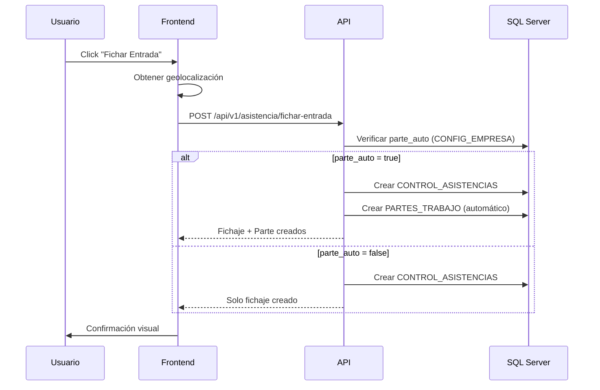
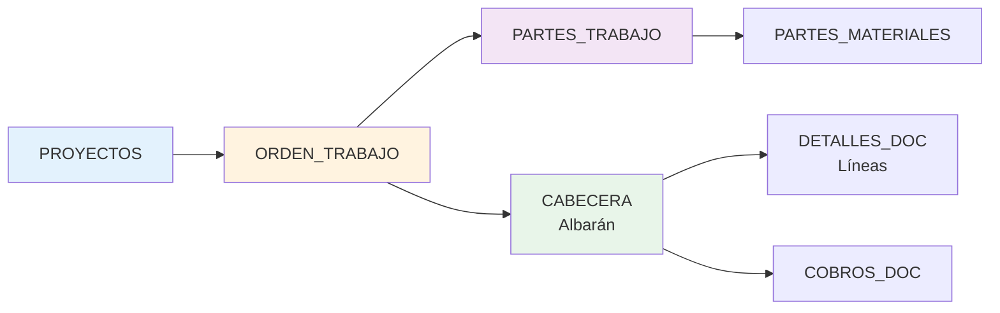

# Vista General de la Arquitectura

## 🏛️ Arquitectura del Sistema

El proyecto **Fichaje** sigue una arquitectura **cliente-servidor** con separación clara entre frontend y backend.



## 🔄 Flujo de Datos

### 1. Autenticación y Autorización



**Componentes clave:**

- **authMiddleware.js**: Verifica el token JWT en cada petición
- **authorizeRol.js**: Verifica permisos por rol (admin, manager, empleado)
- **superadminMiddleware.js**: Protege rutas exclusivas de superadmin

### 2. Flujo de Fichaje (Asistencia)



**Tablas involucradas:**

- `CONTROL_ASISTENCIAS`: Registro de entrada/salida
- `PARTES_TRABAJO`: Partes de trabajo (si parte_auto está activo)
- `CONFIG_EMPRESA`: Configuración por empresa

### 3. Gestión de Proyectos y Órdenes de Trabajo



**Relaciones:**

1. Un **PROYECTO** tiene múltiples **ÓRDENES DE TRABAJO**
2. Una **ORDEN DE TRABAJO** tiene:
   - Múltiples **PARTES DE TRABAJO** (tiempo de empleados)
   - Una **CABECERA** de albarán/factura
3. La **CABECERA** contiene:
   - **DETALLES_DOC** (líneas de facturación)
   - **COBROS_DOC** (pagos recibidos)

## 📦 Estructura de Módulos

### Backend (Express API)

```
backend-AppServicios/
├── server.js                 # Punto de entrada, configuración Express
├── routes/                   # Definición de endpoints
│   ├── authRoutes.js        # /auth/*
│   ├── asistenciaRoutes.js  # /api/v1/asistencia/*
│   ├── proyectosRoutes.js   # /api/v1/proyectos/*
│   ├── parteRoutes.js       # /api/v1/partes/*
│   ├── albaranRoutes.js     # /api/v1/albaran/*
│   ├── notaGastoRoutes.js   # /api/v1/nota-gasto/*
│   └── ...
├── controllers/              # Lógica de negocio
│   ├── asistenciaController.js
│   ├── proyectosController.js
│   ├── albaranController.js
│   └── ...
├── middleware/               # Middlewares
│   ├── authMiddleware.js    # Verificación JWT
│   ├── authorizeRol.js      # Control de roles
│   └── superadminMiddleware.js
├── Model/                    # Modelos Sequelize
│   ├── init-models.js       # Inicialización de modelos
│   ├── USUARIOS.js
│   ├── CONTROL_ASISTENCIAS.js
│   ├── PROYECTOS.js
│   └── ...
├── config/
│   ├── dbConfig.js          # Configuración Sequelize
│   └── ftpConfig.js
└── utils/                    # Utilidades
    └── dateUtils.js
```

**Patrón de diseño**: MVC (Model-View-Controller)

- **Routes**: Definen endpoints y aplican middlewares
- **Controllers**: Implementan la lógica de negocio
- **Models**: Representan tablas de la base de datos

### Frontend (Angular)

```
front-AppServicios/src/app/
├── app.routes.ts            # Configuración de rutas
├── pages/                   # Páginas principales
│   ├── fichar-asistencia/
│   ├── page-proyectos/
│   ├── page-ote/           # Órdenes de trabajo
│   ├── listado-fichaje/
│   └── ...
├── components/              # Componentes reutilizables
│   ├── modal-*/
│   ├── tabla-*/
│   └── ...
├── services/                # Servicios HTTP
│   ├── auth.service.ts
│   ├── asistencia.service.ts
│   ├── proyecto.service.ts
│   └── ...
├── guards/                  # Guards de navegación
│   ├── auth.guard.ts
│   ├── role.guard.ts
│   └── ...
├── interceptors/            # Interceptores HTTP
│   ├── auth.interceptor.ts
│   └── error.interceptor.ts
└── interface/               # Interfaces TypeScript
    ├── usuario.ts
    ├── proyecto.ts
    └── ...
```

**Patrón de diseño**: Component-based architecture

- **Pages**: Componentes de página completa
- **Components**: Componentes reutilizables
- **Services**: Comunicación con API y estado compartido
- **Guards**: Control de acceso a rutas
- **Interceptors**: Procesamiento global de peticiones HTTP

## 🔐 Sistema de Autenticación y Autorización

### Niveles de Acceso

1. **Superadmin**: Acceso total al sistema, gestión de empresas
2. **Admin**: Administrador de empresa
3. **Manager/RRHH**: Gestión de empleados y aprobaciones
4. **Empleado**: Acceso básico (fichaje, partes, vacaciones)

### Flujo de Autorización

```javascript
// En el backend
router.post(
  "/ruta-protegida",
  authenticateToken, // 1. Verifica JWT
  authorizeRol(["admin"]), // 2. Verifica rol
  controller.metodo // 3. Ejecuta lógica
);
```

### Multi-tenancy (Multi-empresa)

El sistema soporta múltiples empresas:

- Cada usuario pertenece a una **empresa** (`id_empresa`)
- El token JWT incluye el `id_empresa`
- Todas las consultas filtran por empresa automáticamente

```javascript
// Ejemplo en controller
const { empresa } = req.user; // Del JWT
const proyectos = await db.PROYECTOS.findAll({
  where: { id_empresa: empresa },
});
```

## 🗄️ Base de Datos

### Esquema Principal (SQL Server)

**Tablas principales:**

| Tabla                 | Descripción                    |
| --------------------- | ------------------------------ |
| `EMPRESA`             | Datos de empresas              |
| `CONFIG_EMPRESA`      | Configuración por empresa      |
| `USUARIOS`            | Usuarios del sistema           |
| `CONTROL_ASISTENCIAS` | Fichajes de entrada/salida     |
| `PROYECTOS`           | Proyectos                      |
| `ORDEN_TRABAJO`       | Órdenes de trabajo             |
| `PARTES_TRABAJO`      | Partes de trabajo de empleados |
| `CABECERA`            | Cabeceras de albaranes         |
| `DETALLES_DOC`        | Líneas de albaranes            |
| `VACACIONES`          | Solicitudes de vacaciones      |
| `NOTIFICACIONES`      | Sistema de notificaciones      |

### ORM: Sequelize

- **Versión**: 6.37.7
- **Dialecto**: mssql (SQL Server)
- **Timezone**: UTC (+00:00)
- **Generación de modelos**: Automática con `sequelize-auto`

```javascript
// Ejemplo de modelo
const USUARIOS = sequelize.define(
  "USUARIOS",
  {
    id: { type: DataTypes.INTEGER, primaryKey: true },
    nombre: DataTypes.STRING,
    id_empresa: DataTypes.INTEGER,
    // ...
  },
  {
    tableName: "USUARIOS",
    timestamps: false,
  }
);
```

## 🌐 API REST

### Estructura de URLs

```
Base URL: http://localhost:3000

Autenticación:
POST   /auth/login
POST   /auth/refresh

Asistencia:
POST   /api/v1/asistencia/fichar-entrada
POST   /api/v1/asistencia/fichar-salida
GET    /api/v1/asistencia/partes-usuario

Proyectos:
GET    /api/v1/proyectos
GET    /api/v1/proyectos/:id
POST   /api/v1/proyectos
PUT    /api/v1/proyectos/:id

Partes de Trabajo:
GET    /api/v1/partes
POST   /api/v1/partes
PUT    /api/v1/partes/:id

Albaranes:
GET    /api/v1/albaran/cabecera
POST   /api/v1/albaran/cabecera
GET    /api/v1/albaran/detalles
POST   /api/v1/albaran/detalles
```

### Formato de Respuestas

**Éxito:**

```json
{
  "data": { ... },
  "message": "Operación exitosa"
}
```

**Error:**

```json
{
  "error": "Mensaje de error",
  "details": "Detalles adicionales"
}
```

**Paginación:**

```json
{
  "data": [...],
  "pagination": {
    "page": 1,
    "limit": 20,
    "total": 100,
    "totalPages": 5
  }
}
```

## 📱 Progressive Web App (PWA)

El frontend está configurado como PWA:

- **Service Worker**: Habilitado (`@angular/service-worker`)
- **Manifest**: `ngsw-config.json`
- **Capacidades offline**: Caché de assets estáticos

## 🔄 Manejo de Fechas

**Importante**: El sistema usa **js-joda** para manejo de fechas en ambos lados:

```javascript
// Backend
const { LocalDateTime, ZoneId } = require("@js-joda/core");
const fecha = LocalDateTime.now(ZoneId.of("Europe/Madrid"));
```

```typescript
// Frontend
import { LocalDateTime, ZoneId } from "@js-joda/core";
const fecha = LocalDateTime.now(ZoneId.of("Europe/Madrid"));
```

**Zona horaria**: Europa/Madrid (configurada en ambos lados)

## 📊 Almacenamiento de Archivos

### Azure Blob Storage

Usado para almacenar:

- Tickets de notas de gasto
- Documentos adjuntos
- Exportaciones de Excel

**Configuración** (variables de entorno):

- `AZURE_STORAGE_CONNECTION_STRING`
- `AZURE_STORAGE_CONTAINER_NAME`

---

**Siguiente**: [Decisiones Arquitectónicas](decisiones.md)
