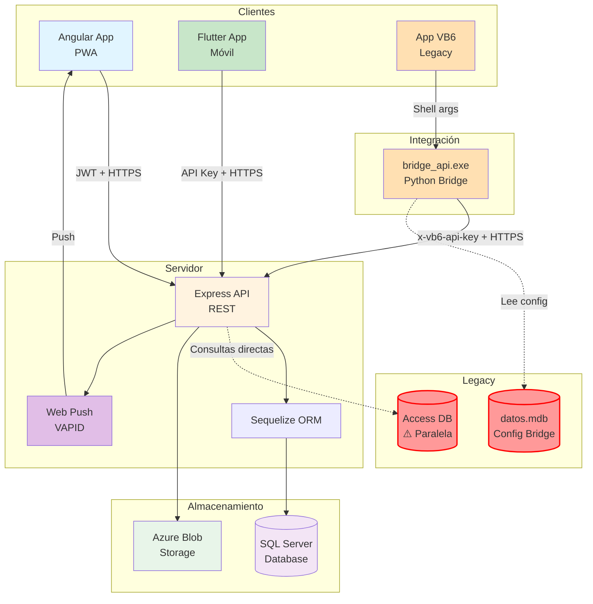
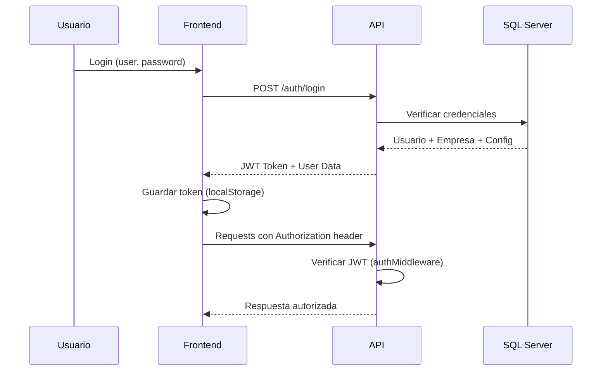
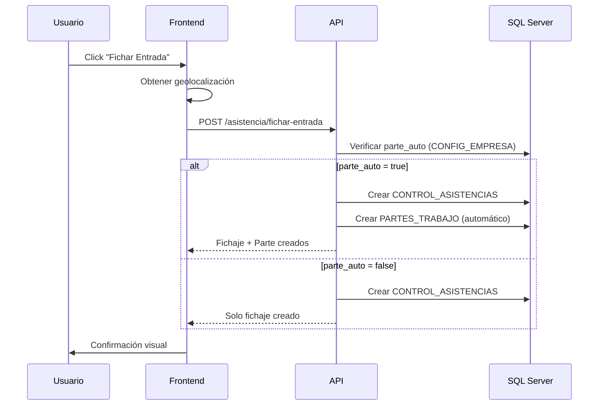
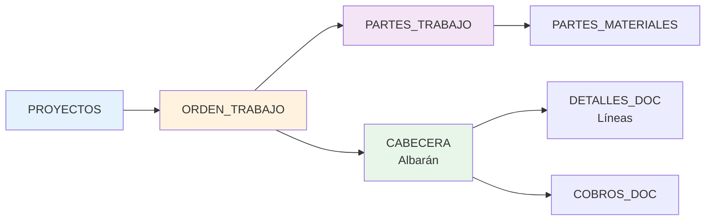
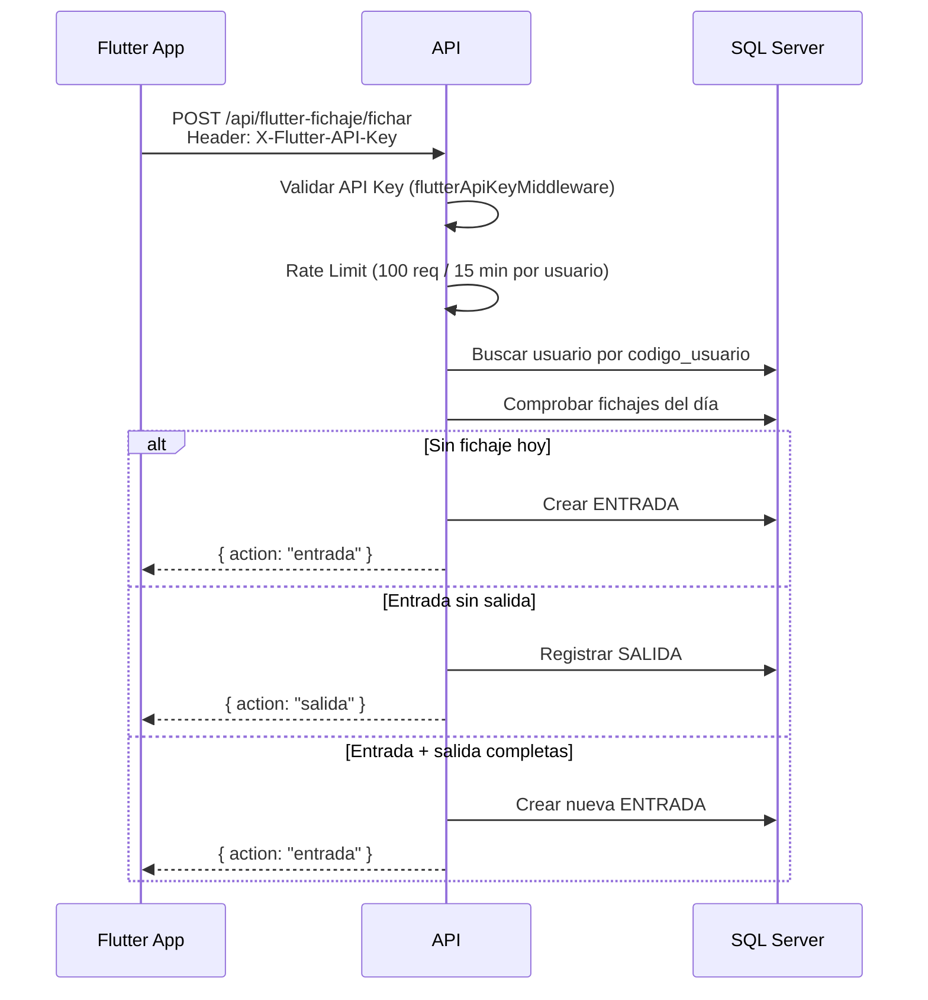
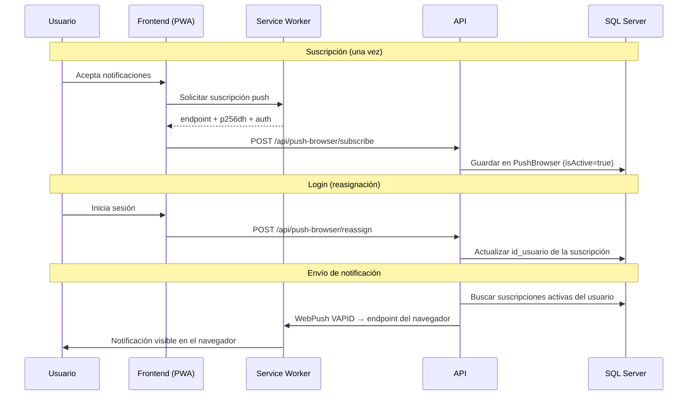
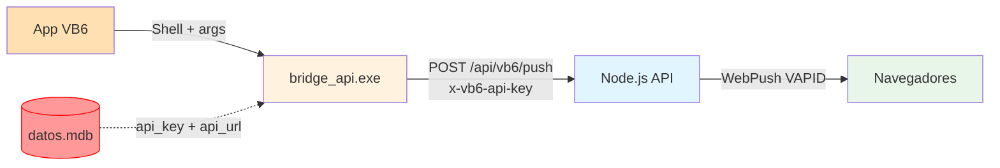

# Vista General de la Arquitectura

## 🏛️ Arquitectura del Sistema

El proyecto **Fichaje** sigue una arquitectura **cliente-servidor** con separación clara entre frontend y backend.


```mermaid
graph TB
    subgraph "Clientes"
        A[Angular App<br/>PWA]
        FL[Flutter App<br/>Móvil]
        VB[App VB6<br/>Legacy]
    end

    subgraph "Integración"
        BR[bridge_api.exe<br/>Python Bridge]
    end

    subgraph "Servidor"
        B[Express API<br/>REST]
        C[Sequelize ORM]
        WP[Web Push<br/>VAPID]
    end

    subgraph "Almacenamiento"
        D[(SQL Server<br/>Database)]
        E[Azure Blob<br/>Storage]
    end

    subgraph "Legacy"
        F[(Access DB<br/>⚠️ Paralela)]
        MDB[(datos.mdb<br/>Config Bridge)]
    end

    A -->|JWT + HTTPS| B
    FL -->|API Key + HTTPS| B
    VB -->|Shell args| BR
    BR -->|x-vb6-api-key + HTTPS| B
    BR -.->|Lee config| MDB
    B --> C
    C --> D
    B -.->|Consultas directas| F
    B --> E
    B --> WP
    WP -->|Push| A

    style F fill:#ff9999,stroke:#ff0000,stroke-width:2px
    style MDB fill:#ff9999,stroke:#ff0000,stroke-width:2px
    style A fill:#e1f5ff
    style FL fill:#c8e6c9
    style VB fill:#ffe0b2
    style BR fill:#ffe0b2
    style B fill:#fff3e0
    style D fill:#f3e5f5
    style E fill:#e8f5e9
    style WP fill:#e1bee7
```

## 🔄 Flujo de Datos

### 1. Autenticación y Autorización


```mermaid
sequenceDiagram
    participant U as Usuario
    participant F as Frontend
    participant A as API
    participant DB as SQL Server

    U->>F: Login (user, password)
    F->>A: POST /auth/login
    A->>DB: Verificar credenciales
    DB-->>A: Usuario + Empresa + Config
    A-->>F: JWT Token + User Data
    F->>F: Guardar token (localStorage)
    F->>A: Requests con Authorization header
    A->>A: Verificar JWT (authMiddleware)
    A-->>F: Respuesta autorizada
```

**Componentes clave:**

- **authMiddleware.js**: Verifica el token JWT en cada petición
- **authorizeRol.js**: Verifica permisos por rol (admin, superadmin, usuario)
- **superadminMiddleware.js**: Protege rutas exclusivas de superadmin

### 2. Flujo de Fichaje (Asistencia)


```mermaid
sequenceDiagram
    participant U as Usuario
    participant F as Frontend
    participant A as API
    participant DB as SQL Server

    U->>F: Click "Fichar Entrada"
    F->>F: Obtener geolocalización
    F->>A: POST /asistencia/fichar-entrada
    A->>DB: Verificar parte_auto (CONFIG_EMPRESA)

    alt parte_auto = true
        A->>DB: Crear CONTROL_ASISTENCIAS
        A->>DB: Crear PARTES_TRABAJO (automático)
        A-->>F: Fichaje + Parte creados
    else parte_auto = false
        A->>DB: Crear CONTROL_ASISTENCIAS
        A-->>F: Solo fichaje creado
    end

    F->>U: Confirmación visual
```

**Tablas involucradas:**

- `CONTROL_ASISTENCIAS`: Registro de entrada/salida
- `PARTES_TRABAJO`: Partes de trabajo (si parte_auto está activo)
- `CONFIG_EMPRESA`: Configuración por empresa

### 3. Gestión de Proyectos y Órdenes de Trabajo


```mermaid
graph LR
    A[PROYECTOS] --> B[ORDEN_TRABAJO]
    B --> C[PARTES_TRABAJO]
    B --> D[CABECERA<br/>Albarán]
    D --> E[DETALLES_DOC<br/>Líneas]
    D --> F[COBROS_DOC]
    C --> G[PARTES_MATERIALES]

    style A fill:#e3f2fd
    style B fill:#fff3e0
    style C fill:#f3e5f5
    style D fill:#e8f5e9
```

**Relaciones:**

1. Un **PROYECTO** tiene múltiples **ÓRDENES DE TRABAJO**
2. Una **ORDEN DE TRABAJO** tiene:
   - Múltiples **PARTES DE TRABAJO** (tiempo de empleados)
   - Una **CABECERA** de albarán/factura
3. La **CABECERA** contiene:
   - **DETALLES_DOC** (líneas de facturación)
   - **COBROS_DOC** (pagos recibidos)

### 4. Fichaje desde Flutter (App Móvil)


```mermaid
sequenceDiagram
    participant FL as Flutter App
    participant A as API
    participant DB as SQL Server

    FL->>A: POST /api/flutter-fichaje/fichar<br/>Header: X-Flutter-API-Key
    A->>A: Validar API Key (flutterApiKeyMiddleware)
    A->>A: Rate Limit (100 req / 15 min por usuario)
    A->>DB: Buscar usuario por codigo_usuario
    A->>DB: Comprobar fichajes del día

    alt Sin fichaje hoy
        A->>DB: Crear ENTRADA
        A-->>FL: { action: "entrada" }
    else Entrada sin salida
        A->>DB: Registrar SALIDA
        A-->>FL: { action: "salida" }
    else Entrada + salida completas
        A->>DB: Crear nueva ENTRADA
        A-->>FL: { action: "entrada" }
    end
```

**Diferencias con el fichaje web:**

- **Sin JWT**: Usa API Key por empresa en header `X-Flutter-API-Key`
- **Identificación**: Por `codigo_usuario` (campo único en USUARIOS), no por token
- **Automático**: Detecta si debe hacer entrada o salida según el estado actual
- **Rate limiting**: 100 peticiones por usuario cada 15 minutos

**Archivos clave:**

- `middleware/flutterApiKeyMiddleware.js` - Valida API Key y resuelve empresa
- `middleware/flutterRateLimitMiddleware.js` - Rate limiting por usuario
- `controllers/flutterFichajeController.js` - Lógica de fichaje
- `routes/flutterFichajeRoutes.js` - Rutas `/api/flutter-fichaje/*`
- `routes/flutterConfigRoutes.js` - Gestión de API Keys (requiere JWT admin)

**Gestión de API Keys:**

| Endpoint | Método | Descripción |
| --- | --- | --- |
| `/api/flutter-config/flutter-api-key/generate/:id_empresa` | POST | Generar API Key nueva |
| `/api/flutter-config/flutter-api-key/:id_empresa` | GET | Obtener API Key actual |
| `/api/flutter-config/flutter-api-key/regenerate/:id_empresa` | POST | Regenerar (invalida anterior) |
| `/api/flutter-config/flutter-api-key/revoke/:id_empresa` | DELETE | Revocar acceso Flutter |

> Documentación detallada: [Flutter Fichaje API](../../backend-AppServicios/FLUTTER_FICHAJE_API.md) | [Flutter API Key Auth](../../backend-AppServicios/FLUTTER_API_KEY_AUTH.md)

### 5. Notificaciones Push (VAPID / Web Push)


```mermaid
sequenceDiagram
    participant U as Usuario
    participant F as Frontend (PWA)
    participant SW as Service Worker
    participant A as API
    participant DB as SQL Server

    Note over U,DB: Suscripción (una vez)
    U->>F: Acepta notificaciones
    F->>SW: Solicitar suscripción push
    SW-->>F: endpoint + p256dh + auth
    F->>A: POST /api/push-browser/subscribe
    A->>DB: Guardar en PushBrowser (isActive=true)

    Note over U,DB: Login (reasignación)
    U->>F: Inicia sesión
    F->>A: POST /api/push-browser/reassign
    A->>DB: Actualizar id_usuario de la suscripción

    Note over U,DB: Envío de notificación
    A->>DB: Buscar suscripciones activas del usuario
    A->>SW: WebPush VAPID → endpoint del navegador
    SW->>U: Notificación visible en el navegador
```

**Componentes clave:**

- **Backend**: `config/push.js` (configuración VAPID), `controllers/pushBrowserController.js`
- **Frontend**: `services/push/push.service.ts` (suscripción, reasignación, desactivación)
- **Tabla BD**: `PushBrowser` (endpoint, p256dh, auth, isActive, id_usuario)

**Ciclo de vida de las suscripciones:**

| Evento | Acción | Método |
| --- | --- | --- |
| Primera visita | Solicitar permiso y suscribir | `subscribeToNotifications()` |
| Login | Reasignar suscripción al usuario actual | `reassignSubscriptionOnLogin()` |
| Logout | Desactivar suscripción (isActive=false) | `deactivateSubscriptionOnLogout()` |
| Error 410/404 | Desactivar automáticamente (endpoint caducado) | Automático en `sendPushToUsers()` |

**Enviar notificaciones desde código:**

```javascript
const { sendPushToUsers } = require('./controllers/pushBrowserController');

// A un usuario
await sendPushToUsers(123, 'Título', 'Mensaje');

// A varios usuarios
await sendPushToUsers([10, 20, 30], 'Título', 'Mensaje');

// A todos los suscritos
await sendPushToUsers(null, 'Título', 'Mensaje broadcast');

// Con URL de destino personalizada
await sendPushToUsers(123, 'Vacación Aprobada', 'Tu solicitud fue aprobada', '/vacaciones');
```

> Documentación detallada: [Guía de Push Notifications](../../backend-AppServicios/PUSH_NOTIFICATIONS_USAGE.md)

### 6. VB6-Bridge (Integración Legacy)


```mermaid
graph LR
    VB[App VB6] -->|Shell + args| BR[bridge_api.exe]
    MDB[(datos.mdb)] -.->|api_key + api_url| BR
    BR -->|POST /api/vb6/push<br/>x-vb6-api-key| API[Node.js API]
    API -->|WebPush VAPID| NAV[Navegadores]

    style VB fill:#ffe0b2
    style BR fill:#fff3e0
    style MDB fill:#ff9999,stroke:#ff0000
    style API fill:#e1f5ff
    style NAV fill:#e8f5e9
```

**Propósito:** Permitir que aplicaciones VB6 legacy envíen notificaciones push a usuarios del sistema.

**Flujo:**

1. El superadmin genera una API Key VB6 para la empresa desde el panel web
2. Se configura un Access local (`datos.mdb`) con tabla `configuracion_api` que contiene `Api_Key` y `Api_Url`
3. La app VB6 ejecuta `bridge_api.exe` pasando argumentos por línea de comandos
4. El bridge lee `Api_Key` y `Api_Url` del Access protegido con contraseña
5. Realiza `POST /api/vb6/push` con header `x-vb6-api-key`
6. El backend valida la clave contra `CONFIG_EMPRESA.vb6_api_key` y envía las notificaciones via Web Push

**Uso desde VB6:**

```vb
cmdLine = "C:\app\bridge_api.exe --usuarios 1,2 --asunto ""Aviso"" --cuerpo ""Mensaje"""
Set oExec = CreateObject("WScript.Shell").Exec(cmdLine)
resultado = oExec.StdOut.ReadAll   ' JSON: {"ok": true, "enviados": 2}
```

**Archivos clave:**

- `vb6-bridge/bridge_api.py` - Script Python principal
- `middleware/vb6ApiKeyMiddleware.js` - Validación de API Key VB6
- `controllers/vb6Controller.js` - Endpoint de push para VB6
- `routes/vb6Routes.js` - Rutas `/api/vb6/*`

**Configuración del Access (`datos.mdb`):**

La tabla `configuracion_api` almacena las credenciales que el bridge necesita:

| Campo     | Descripción                                              |
| --------- | -------------------------------------------------------- |
| `Api_Key` | API Key VB6 generada desde el panel SuperAdmin           |
| `Api_Url` | URL base del backend en Azure (con `/` al final)         |

**Requisitos de despliegue:**

- Python 3.9+ para desarrollo (compilar con `pyinstaller --onefile bridge_api.py`)
- Microsoft Access Database Engine en la máquina cliente
- API Key VB6 generada desde el panel SuperAdmin (almacenada en `CONFIG_EMPRESA.vb6_api_key`)

> Documentación detallada: [VB6-Bridge README](../../vb6-bridge/README.md)

---

## 📦 Estructura de Módulos

### Backend (Express API)

```
backend-AppServicios/
├── server.js                          # Punto de entrada, configuración Express
├── routes/                            # Definición de endpoints
│   ├── authRoutes.js                 # /auth/*
│   ├── asistenciaRoutes.js           # /asistencia/*
│   ├── proyectosRoutes.js            # /proyectos/*
│   ├── parteRoutes.js                # /partes/*
│   ├── albaranRoutes.js              # /albaran/*
│   ├── notaGastoRoutes.js            # /nota-gasto/*
│   ├── pushBrowserRoutes.js          # /api/push-browser/* (suscripciones push)
│   ├── flutterFichajeRoutes.js       # /api/flutter-fichaje/* (fichaje móvil)
│   ├── flutterConfigRoutes.js        # /api/flutter-config/* (gestión API keys)
│   ├── vb6Routes.js                  # /api/vb6/* (bridge VB6 → push)
│   └── ...
├── controllers/                       # Lógica de negocio
│   ├── asistenciaController.js
│   ├── proyectosController.js
│   ├── albaranController.js
│   ├── pushBrowserController.js      # Push: suscripción + envío VAPID
│   ├── flutterFichajeController.js   # Fichaje desde Flutter
│   ├── flutterConfigController.js    # CRUD de API Keys Flutter
│   ├── vb6Controller.js              # Endpoint push para VB6
│   └── ...
├── middleware/                        # Middlewares
│   ├── authMiddleware.js             # Verificación JWT
│   ├── authorizeRol.js               # Control de roles
│   ├── superadminMiddleware.js
│   ├── flutterApiKeyMiddleware.js    # Validación API Key Flutter
│   ├── flutterRateLimitMiddleware.js # Rate limiting Flutter
│   └── vb6ApiKeyMiddleware.js        # Validación API Key VB6
├── Model/                             # Modelos Sequelize
│   ├── init-models.js                # Inicialización de modelos
│   ├── USUARIOS.js                   # (incluye campo codigo_usuario)
│   ├── CONTROL_ASISTENCIAS.js
│   ├── PROYECTOS.js
│   ├── push_browser.js               # Suscripciones push
│   ├── CONFIG_EMPRESA.js             # (incluye flutter_api_key)
│   └── ...
├── config/
│   ├── dbConfig.js                   # Configuración Sequelize
│   ├── push.js                       # Configuración VAPID (web-push)
│   └── ftpConfig.js
└── utils/                             # Utilidades
    └── dateUtils.js
```

**Patrón de diseño**: MVC (Model-View-Controller)

- **Routes**: Definen endpoints y aplican middlewares
- **Controllers**: Implementan la lógica de negocio
- **Models**: Representan tablas de la base de datos

### Frontend (Angular)

```
front-AppServicios/src/app/
├── app.routes.ts            # Configuración de rutas
├── pages/                   # Páginas principales
│   ├── fichar-asistencia/
│   ├── page-proyectos/
│   ├── page-ote/           # Órdenes de trabajo
│   ├── listado-fichaje/
│   └── ...
├── components/              # Componentes reutilizables
│   ├── modal-*/
│   ├── tabla-*/
│   └── ...
├── services/                # Servicios HTTP
│   ├── auth.service.ts
│   ├── asistencia.service.ts
│   ├── proyecto.service.ts
│   └── ...
├── guards/                  # Guards de navegación
│   ├── auth.guard.ts
│   ├── role.guard.ts
│   └── ...
├── interceptors/            # Interceptores HTTP
│   ├── auth.interceptor.ts
│   └── error.interceptor.ts
└── interface/               # Interfaces TypeScript
    ├── usuario.ts
    ├── proyecto.ts
    └── ...
```

**Patrón de diseño**: Component-based architecture

- **Pages**: Componentes de página completa
- **Components**: Componentes reutilizables
- **Services**: Comunicación con API y estado compartido
- **Guards**: Control de acceso a rutas
- **Interceptors**: Procesamiento global de peticiones HTTP

## 🔐 Sistema de Autenticación y Autorización

### Niveles de Acceso

#### 1. Superadmin

Usuario interno para gestión global de empresas.

#### 2. Admin

Administrador de empresa (Gestión si no hay vínculo ERP).

#### 3. Usuario

Usuario estándar del sistema.

**Categorías Laborales (Funcionalidad extra):**

- **Técnico**: Permisos extra en gestión de OTs.
- **Operario/Administrativo**: Funcionalidad estándar.

### Flujo de Autorización

```javascript
// En el backend
router.post(
  "/ruta-protegida",
  authenticateToken, // 1. Verifica JWT
  authorizeRol(["admin"]), // 2. Verifica rol
  controller.metodo // 3. Ejecuta lógica
);
```

### Métodos de Autenticación

El sistema tiene **tres métodos** de autenticación según el cliente:

| Cliente | Método | Header | Middleware |
| --- | --- | --- | --- |
| **Angular (Web)** | JWT Bearer Token | `Authorization: Bearer <token>` | `authMiddleware.js` |
| **Flutter (Móvil)** | API Key por empresa | `X-Flutter-API-Key: <key>` | `flutterApiKeyMiddleware.js` |
| **VB6 (Legacy)** | API Key compartida | `x-vb6-api-key: <key>` | `vb6ApiKeyMiddleware.js` |

### Multi-tenancy (Multi-empresa)

El sistema soporta múltiples empresas:

- Cada usuario pertenece a una **empresa** (`id_empresa`)
- El token JWT incluye el `id_empresa`
- Todas las consultas filtran por empresa automáticamente

```javascript
// Ejemplo en controller
const { empresa } = req.user; // Del JWT
const proyectos = await db.PROYECTOS.findAll({
  where: { id_empresa: empresa },
});
```

## 🗄️ Base de Datos

### Esquema Principal (SQL Server)

**Tablas principales:**

| Tabla                 | Descripción                                          |
| --------------------- | ---------------------------------------------------- |
| `EMPRESA`             | Datos de empresas                                    |
| `CONFIG_EMPRESA`      | Configuración por empresa (incluye `flutter_api_key`) |
| `USUARIOS`            | Usuarios del sistema (incluye `codigo_usuario`)       |
| `CONTROL_ASISTENCIAS` | Fichajes de entrada/salida                            |
| `PROYECTOS`           | Proyectos                                            |
| `ORDEN_TRABAJO`       | Órdenes de trabajo                                   |
| `PARTES_TRABAJO`      | Partes de trabajo de empleados                       |
| `CABECERA`            | Cabeceras de albaranes                               |
| `DETALLES_DOC`        | Líneas de albaranes                                  |
| `VACACIONES`          | Solicitudes de vacaciones                            |
| `NOTIFICACIONES`      | Sistema de notificaciones                            |
| `PushBrowser`         | Suscripciones push (endpoint, p256dh, auth, isActive) |

### ORM: Sequelize

- **Versión**: 6.37.7
- **Dialecto**: mssql (SQL Server)
- **Timezone**: UTC (+00:00)
- **Generación de modelos**: Automática con `sequelize-auto`

```javascript
// Ejemplo de modelo
const USUARIOS = sequelize.define(
  "USUARIOS",
  {
    id: { type: DataTypes.INTEGER, primaryKey: true },
    nombre: DataTypes.STRING,
    id_empresa: DataTypes.INTEGER,
    // ...
  },
  {
    tableName: "USUARIOS",
    timestamps: false,
  }
);
```

## 🌐 API REST

### Estructura de URLs

```
Base URL: http://localhost:3000

─── Autenticación JWT ───
POST   /auth/login
POST   /auth/refresh

─── Asistencia (JWT) ───
POST   /asistencia/fichar-entrada
POST   /asistencia/fichar-salida
GET    /asistencia/partes-usuario

─── Proyectos (JWT) ───
GET    /proyectos
GET    /proyectos/:id
POST   /proyectos
PUT    /proyectos/:id

─── Partes de Trabajo (JWT) ───
GET    /partes
POST   /partes
PUT    /partes/:id

─── Albaranes (JWT) ───
GET    /albaran/cabecera
POST   /albaran/cabecera
GET    /albaran/detalles
POST   /albaran/detalles

─── Flutter Fichaje (API Key: X-Flutter-API-Key) ───
POST   /api/flutter-fichaje/fichar        # Entrada/salida automática
POST   /api/flutter-fichaje/isAdmin       # Verificar si es admin

─── Flutter Config (JWT admin) ───
POST   /api/flutter-config/flutter-api-key/generate/:id_empresa
GET    /api/flutter-config/flutter-api-key/:id_empresa
POST   /api/flutter-config/flutter-api-key/regenerate/:id_empresa
DELETE /api/flutter-config/flutter-api-key/revoke/:id_empresa

─── Push Notifications (JWT) ───
POST   /api/push-browser/subscribe        # Suscribir navegador
POST   /api/push-browser/reassign         # Reasignar al usuario actual
POST   /api/push-browser/deactivate       # Desactivar suscripción

─── VB6 Bridge (API Key: x-vb6-api-key) ───
POST   /api/vb6/push                      # Enviar push desde VB6
```

### Formato de Respuestas

**Éxito:**

```json
{
  "data": { ... },
  "message": "Operación exitosa"
}
```

**Error:**

```json
{
  "error": "Mensaje de error",
  "details": "Detalles adicionales"
}
```

**Paginación:**

```json
{
  "data": [...],
  "pagination": {
    "page": 1,
    "limit": 20,
    "total": 100,
    "totalPages": 5
  }
}
```

## 📱 Progressive Web App (PWA)

El frontend está configurado como PWA:

- **Service Worker**: Habilitado (`@angular/service-worker`)
- **Manifest**: `ngsw-config.json`
- **Capacidades offline**: Caché de assets estáticos

## 🔄 Manejo de Fechas

> [!IMPORTANT] > **TRANSICIÓN EN CURSO**: El proyecto está migrando de `js-joda` a `date-fns`. Código nuevo debe usar `date-fns`.

**Librería actual (código nuevo):** date-fns + date-fns-tz

```javascript
// Backend
const { format, parseISO } = require("date-fns");
const { utcToZonedTime } = require("date-fns-tz");
const fecha = utcToZonedTime(new Date(), "Europe/Madrid");
```

```typescript
// Frontend
import { format, parseISO } from "date-fns";
import { utcToZonedTime } from "date-fns-tz";
const fecha = utcToZonedTime(new Date(), "Europe/Madrid");
```

**Código legacy:** Aún encontrarás `js-joda` en partes antiguas del código.

**Zona horaria**: Europa/Madrid (configurada en ambos lados)

## 📊 Almacenamiento de Archivos

### Azure Blob Storage

Usado para almacenar:

- Tickets de notas de gasto
- Documentos adjuntos
- Exportaciones de Excel

**Configuración** (variables de entorno):

- `AZURE_STORAGE_CONNECTION_STRING`
- `AZURE_STORAGE_CONTAINER_NAME`

## 🌍 Infraestructura y Despliegue

> [!IMPORTANT]
> La infraestructura es compleja debido a la coexistencia de sistemas legacy y modernos.
> **Consulta el documento dedicado:** 📄 [Infraestructura y Despliegue](infraestructura.md)

### Resumen Rápido

- **6 Bases de Datos**: Mezcla de dedicadas y multi-tenant.
- **5 Entornos de Producción**: Gestionados por ramas de Git (`main`, `LaTorre`, `kong1`, etc.).
- **Modelo Híbrido**: Transición de "Servidor por Cliente" a "Multi-tenant".

Ver detalle completo en [Infraestructura](infraestructura.md).

---

**Siguiente**: [Decisiones Arquitectónicas](decisiones.md)
